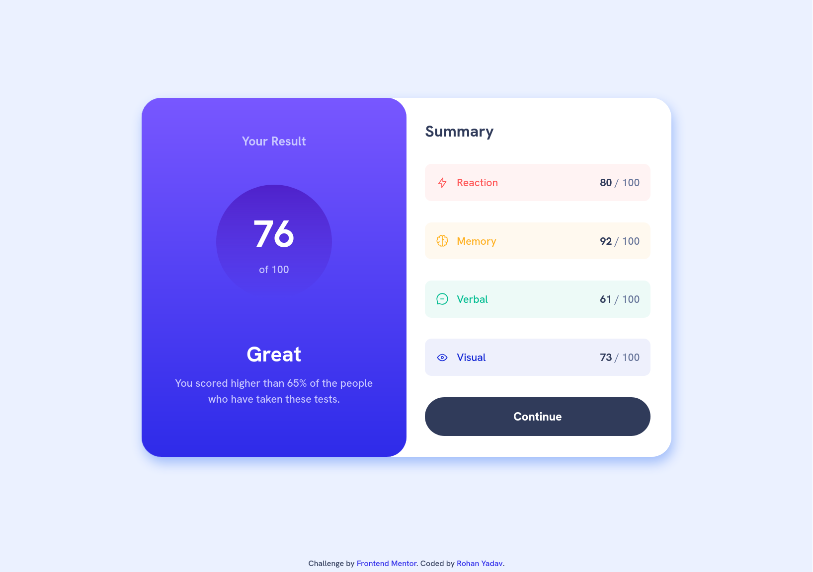

# Frontend Mentor - Results summary component solution

This is a solution to the [Results summary component challenge on Frontend Mentor](https://www.frontendmentor.io/challenges/results-summary-component-CE_K6s0maV). I build it using css, html. I have not used js to dynamically populate the content using the provided data.json file yet.

## Table of contents

-   [Overview](#overview)
    -   [The challenge](#the-challenge)
    -   [Screenshot](#screenshot)
    -   [Links](#links)
-   [My process](#my-process)
    -   [Built with](#built-with)
    -   [What I learned](#what-i-learned)
    -   [Continued development](#continued-development)
    -   [Useful resources](#useful-resources)
-   [Author](#author)

## Overview

### The challenge

Users should be able to:

-   View the optimal layout for the interface depending on their device's screen size
-   See hover and focus states for all interactive elements on the page
-   **Bonus**: Use the local JSON data to dynamically populate the content

### Screenshot

### Links

-   Solution URL: [Add solution URL here](https://your-solution-url.com)
-   Live Site URL: [Add live site URL here](https://your-live-site-url.com)

## My process

### Built with

-   Semantic HTML5 markup
-   CSS custom properties
-   Flexbox
-   CSS Grid
-   Mobile-first workflow

### What I learned

I tinkered with `linear-gradient()` to get a feel how it works, how it is an `<image>` data-type in css, so to use it I have to use `background-image` css property instead of `background-color`.

### Continued development

I will complete the **bonus** part of the challenge, which is to use the provided `data.json` file to populate data dynamically.

### Useful resources

-   [MDN for `gradient`](https://developer.mozilla.org/en-US/docs/Web/CSS/CSS_images/Using_CSS_gradients)

## Author

-   Frontend Mentor - [@r-yadav01](https://www.frontendmentor.io/profile/r-yadav01)
-   Twitter - [@r_yadav01](https://x.com/r_yadav01)
